# Local Deep Research Engine + Research Assistant

A **fully local, terminal-based research system** built around Ollama and large open-weight language models.

This repository contains two related but separate applications:

1. **Deep Research Engine** — a multi-pass literature and web research agent that plans a research problem, searches scholarly and technical sources, builds an evidence corpus, performs adversarial review and gap searching, synthesizes the evidence, reviews the final report, and exports a verified PDF.
2. **Research Assistant** — an interactive local chatbot that can work in normal chat, research-follow-up, and document-understanding modes. It can use saved deep-research runs, fresh web search, a local PDF/DOCX/TXT/Markdown RAG library, and multimodal image understanding through Qwen3.8.

Both applications use the same workspace and the same local Ollama service, but they have **separate configuration files, workflows, and responsibilities**.

> **Current deployment model:** terminal only.

---

## Table of contents

- [1. System overview](#1-system-overview)
- [2. What is included](#2-what-is-included)
- [3. Hardware and software assumptions](#3-hardware-and-software-assumptions)
- [4. Required local models](#4-required-local-models)
- [5. Repository layout](#5-repository-layout)
- [6. Installation from a fresh machine](#6-installation-from-a-fresh-machine)
- [7. Ollama setup](#7-ollama-setup)
- [8. Python environment and dependencies](#8-python-environment-and-dependencies)
- [9. Configuration files](#9-configuration-files)
- [10. Deep Research Engine](#10-deep-research-engine)
  - [10.1 Purpose](#101-purpose)
  - [10.2 Model roles](#102-model-roles)
  - [10.3 Deep mode](#103-deep-mode)
  - [10.4 Short mode](#104-short-mode)
  - [10.5 Smoke test](#105-smoke-test)
  - [10.6 Full workflow](#106-full-workflow)
  - [10.7 Search and evidence architecture](#107-search-and-evidence-architecture)
  - [10.8 Hierarchical synthesis](#108-hierarchical-synthesis)
  - [10.9 Adversarial and blind-gap passes](#109-adversarial-and-blind-gap-passes)
  - [10.10 Final review and PDF generation](#1010-final-review-and-pdf-generation)
  - [10.11 Engine command reference](#1011-engine-command-reference)
  - [10.12 Engine environment variables](#1012-engine-environment-variables)
- [11. Research Assistant](#11-research-assistant)
  - [11.1 Purpose](#111-purpose)
  - [11.2 Three intention categories](#112-three-intention-categories)
  - [11.3 Normal Chat](#113-normal-chat)
  - [11.4 Research](#114-research)
  - [11.5 Document Understanding](#115-document-understanding)
  - [11.6 Document RAG architecture](#116-document-rag-architecture)
  - [11.7 PDF extraction and OCR](#117-pdf-extraction-and-ocr)
  - [11.8 Multimodal image understanding](#118-multimodal-image-understanding)
  - [11.9 Web-search control](#119-web-search-control)
  - [11.10 Memory and topic scoping](#1110-memory-and-topic-scoping)
  - [11.11 Deep Research integration](#1111-deep-research-integration)
  - [11.12 Terminal command reference](#1112-terminal-command-reference)
  - [11.13 Assistant environment variables](#1113-assistant-environment-variables)
- [12. Document library setup](#12-document-library-setup)
- [13. Image library setup](#13-image-library-setup)
- [14. Running both applications](#14-running-both-applications)
- [15. Recommended configuration for a 16 GB GPU](#15-recommended-configuration-for-a-16-gb-gpu)
- [16. API keys and optional providers](#16-api-keys-and-optional-providers)
- [17. Understanding generated data](#17-understanding-generated-data)
- [18. GitHub and moving the system to another machine](#18-github-and-moving-the-system-to-another-machine)
- [19. Recommended `.gitignore`](#19-recommended-gitignore)
- [20. Troubleshooting](#20-troubleshooting)
- [21. Typical workflows](#21-typical-workflows)
- [22. Design principles and limitations](#22-design-principles-and-limitations)
- [23. Future extension points](#23-future-extension-points)

---

# 1. System overview

The project is deliberately divided into a **research engine** and an **interactive research assistant**.

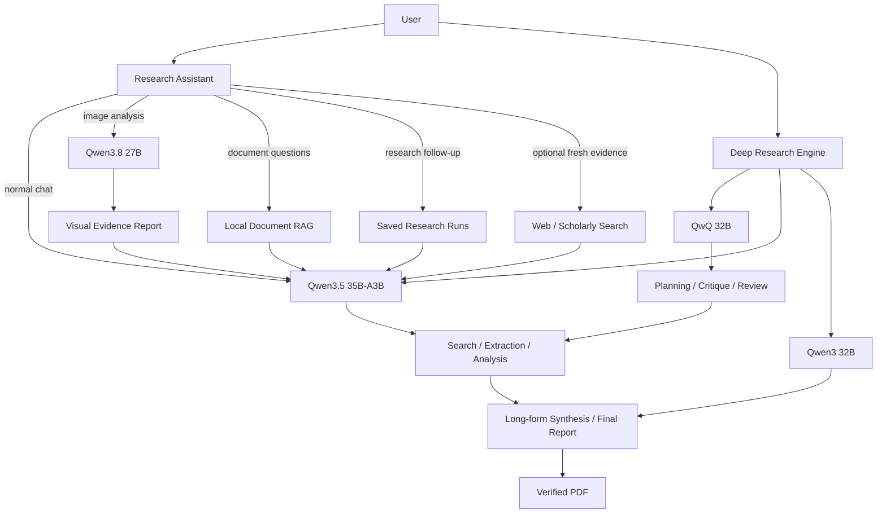

The key distinction is:

- **Deep Research Engine:** starts with a research question and constructs a new research corpus and final report.
- **Research Assistant:** starts with an interactive conversation and uses existing research, local documents, web evidence, and images as optional context.

---

# 2. What is included

A typical repository contains at least:

```text
deep_research_engine/
├── deep_research_engine.py
├── research_assistant.py
├── requirements.txt
├── document_library.yaml
├── run_research.sh
├── run_research_assistant.sh
├── setup.sh
├── check_setup.py
│
├── .env.deep_research_engine        # local, do not commit secrets
├── .env.research_assistant          # local, do not commit secrets
│
├── documents/
│   ├── ROV_Control/
│   ├── AEROSUB/
│   ├── Thesis/
│   └── General/
│
├── images/
│   ├── ROV/
│   ├── AEROSUB/
│   ├── Thesis/
│   └── General/
│
├── runs/                            # Deep Research Engine runs
├── followup_runs/                   # Research Assistant research follow-ups
├── quick_research_runs/             # Research Assistant quick/new-topic traces
├── conversation_sessions/           # persistent assistant conversations
├── rag_index/                       # local document RAG SQLite database
└── *.pdf                            # final Deep Research PDF reports
```

Some generated directories are created automatically. In particular, the Research Assistant launcher creates:

```text
documents/ROV_Control
documents/AEROSUB
documents/Thesis
documents/General
images
```

The Deep Research Engine creates timestamped directories under `runs/`.

---

# 3. Hardware and software assumptions

## 3.1 Current reference hardware

The current configuration was designed around:

- NVIDIA RTX 5000 Ada
- 16 GB VRAM
- substantial system RAM
- Ubuntu/Linux
- Ollama for local inference
- one large local model request at a time as the safe baseline

Large models may be split between GPU and CPU/RAM. A model fitting in Ollama does **not** imply that the complete model is resident in VRAM.

For this reason, the engine defaults to conservative concurrency.

The Deep Research Engine source defaults to:

```text
DEEP_MAX_LLM_CONCURRENCY=1
DEEP_MAX_TASK_CONCURRENCY=1
```

and the Short mode also defaults to 1/1.

Do not increase concurrency simply because multiple tasks are available. Large local models can become slower or unstable if several large requests compete for memory.

## 3.2 Required software

Install:

- Ubuntu/Linux
- Python 3.10 or newer
- Python `venv`
- `pip`
- Git (needed to clone/update the repository)
- Ollama
- Tesseract OCR (`tesseract-ocr`) for scanned-PDF OCR

Recommended Ubuntu packages:

```bash
sudo apt update
sudo apt install -y \
  python3 \
  python3-venv \
  python3-pip \
  git \
  tesseract-ocr
```

Python 3.10+ is required by the current source syntax.

---

# 4. Required local models

## 4.1 Deep Research Engine models

The engine uses three model families by role.

| Model | Role |
|---|---|
| `qwq:32b` | Planning, adversarial review, gap planning, final review |
| `qwen3.5:35b-a3b` | Search strategy, broad research, source extraction, deep paper analysis |
| `qwen3:32b` | Long-form synthesis and final report writing |

Pull them with Ollama:

```bash
ollama pull qwq:32b
ollama pull qwen3.5:35b-a3b
ollama pull qwen3:32b
```

Verify:

```bash
ollama list
```

The engine's smoke test checks that these model names are installed.

## 4.2 Research Assistant models

The Research Assistant uses:

| Model | Role |
|---|---|
| `qwen3.5:35b-a3b` | Main answer model and lightweight query/memory operations |
| `qwen3.8:27b` | Dedicated visual evidence extraction from attached images |

Pull the vision model:

```bash
ollama pull qwen3.8:27b
```

Optional embedding model:

```bash
ollama pull nomic-embed-text
```

You only need `nomic-embed-text` when:

```env
RAG_EMBEDDINGS_ENABLED=true
```

The default is:

```env
RAG_EMBEDDINGS_ENABLED=false
```

so the RAG system can run using lexical/BM25-style retrieval without a separate embedding model.

## 4.3 Why the vision model is separate

The image pipeline is deliberately serial:

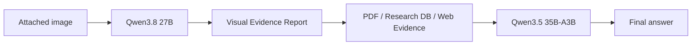

Qwen3.8 is not the final answer model.

Its job is to extract:

- visible text
- labels
- equations
- components
- values
- relationships
- plot trends
- diagram structure
- uncertainty

The final Qwen3.5 model then reasons over that evidence.

This prevents the visual model from being responsible for the entire research answer.

---

# 5. Repository layout

The core runtime files are:

```text
deep_research_engine.py
    └── Deep Research Engine

research_assistant.py
    └── interactive local Research Assistant

setup.sh
    └── fresh-machine bootstrap: Ubuntu packages, Ollama, models, Python environment, dependencies, smoke test

run_research.sh
    └── Deep Research launcher

run_research_assistant.sh
    └── Research Assistant launcher

document_library.yaml
    └── document-project definitions

check_setup.py
    └── Deep Research smoke-test wrapper

requirements.txt
    └── shared Python dependencies
```

Configuration is split deliberately:

```text
.env.deep_research_engine
        │
        └── Deep Research Engine only

.env.research_assistant
        │
        └── Research Assistant only
```

Do not assume that a variable in one file changes the other application.

---

# 6. Installation from a fresh machine

### Quick start

For a fresh Ubuntu machine, the shortest supported setup is:

```bash
git clone https://github.com/CRB20/deep_research_engine.git
cd deep_research_engine

chmod +x setup.sh run_research.sh run_research_assistant.sh
./setup.sh
```

`setup.sh` is the preferred installation method. It installs/verifies the OS prerequisites, Ollama, the required models, the Python virtual environment, and the packages in `requirements.txt`, then runs the Deep Research Engine smoke test.


## 6.1 Clone the repository

Replace the repository URL with your GitHub repository:

```bash
git clone https://github.com/CRB20/deep_research_engine.git
cd deep_research_engine
```

If the repository directory has another name:

```bash
cd <repository-directory>
```

Check the files:

```bash
ls
```

You should see at least:

```text
.env.deep_research_engine
.env.research_assistant
deep_research_engine.py
research_assistant.py
requirements.txt
document_library.yaml
run_research.sh
run_research_assistant.sh
check_setup.py
```

## 6.2 Recommended: run the automated setup script

The repository includes `setup.sh` so a new Ubuntu machine can be prepared with one command.

Make the script executable if needed:

```bash
chmod +x setup.sh
```

Then run:

```bash
./setup.sh
```

The setup script is designed to be safe to rerun. It checks for existing components before installing or pulling them again.

It performs the following steps:

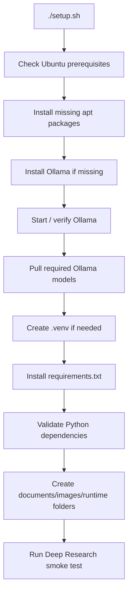

### Ubuntu packages installed by `setup.sh`

The current bootstrap script checks/installs:

```text
python3
python3-venv
curl
tesseract-ocr
tesseract-ocr-eng
```

The repository also expects Git for cloning/updating the project:

```bash
sudo apt install -y git
```

Git can be installed manually before cloning if it is not already available.

### Ollama setup performed by `setup.sh`

If `ollama` is not available, the script installs it using the official Ollama installer.

It then checks the local Ollama API at:

```text
http://127.0.0.1:11434
```

and starts/enables the Ollama service when possible.

### Models pulled by `setup.sh`

The bootstrap script ensures these models are installed:

```text
qwq:32b
qwen3.5:35b-a3b
qwen3:32b
qwen3.8:27b
```

These are the models required by the current Deep Research Engine and multimodal Research Assistant configuration.

### Python environment and requirements installation

`setup.sh` creates the virtual environment:

```text
.venv/
```

and installs the complete shared dependency set with:

```bash
python -m pip install -r requirements.txt
```

The `requirements.txt` file is therefore part of the installation process and should be committed to GitHub.

The current requirements include the PDF/OCR stack and YAML configuration dependency:

```text
PyYAML>=6.0
PyMuPDF>=1.24.0
pypdf>=5.0.0
pytesseract>=0.3.13
Pillow>=10.0.0
fonttools>=4.50.0
```

### Runtime folders created automatically

The setup process prepares:

```text
documents/ROV_Control/
documents/AEROSUB/
documents/Thesis/
documents/General/
images/
runs/
followup_runs/
quick_research_runs/
conversation_sessions/
rag_index/
```

### Configuration files are deliberately not auto-created with secrets

Do **not** put API keys directly into GitHub.

After setup, create your local configuration files:

```text
.env.deep_research_engine
.env.research_assistant
```

from the repository's example/template files when those templates are provided.

If you already have machine-specific `.env` files, copy them into the cloned repository manually.

## 6.3 Manual installation

Use the manual path if you do not want the bootstrap script to install system packages or models automatically.

Install system dependencies:

```bash
sudo apt update
sudo apt install -y \
  python3 \
  python3-venv \
  python3-pip \
  git \
  curl \
  tesseract-ocr \
  tesseract-ocr-eng
```

Install Ollama and verify:

```bash
ollama --version
ollama list
```

If necessary:

```bash
ollama serve
```

Pull the required models:

```bash
ollama pull qwq:32b
ollama pull qwen3.5:35b-a3b
ollama pull qwen3:32b
ollama pull qwen3.8:27b
```

Optional embedding model:

```bash
ollama pull nomic-embed-text
```

Create the Python environment:

```bash
python3 -m venv .venv
source .venv/bin/activate
python -m pip install --upgrade pip setuptools wheel
pip install -r requirements.txt
```


## 6.5 Verify the Deep Research Engine

From the project root:

```bash
source .venv/bin/activate
python deep_research_engine.py --smoke-test
```

The smoke test should complete successfully before you launch a full research run.

## 6.6 Verify the Research Assistant

Run:

```bash
python research_assistant.py --self-test
```

This validates the Research Assistant's configuration, paths, Ollama connectivity, RAG setup, and Deep Research integration.

## 6.7 Start the applications

Deep Research Engine:

```bash
./run_research.sh
```

Research Assistant:

```bash
./run_research_assistant.sh
```

# 7. Ollama setup

Ollama is the local model server used by both applications.

Typical topology:

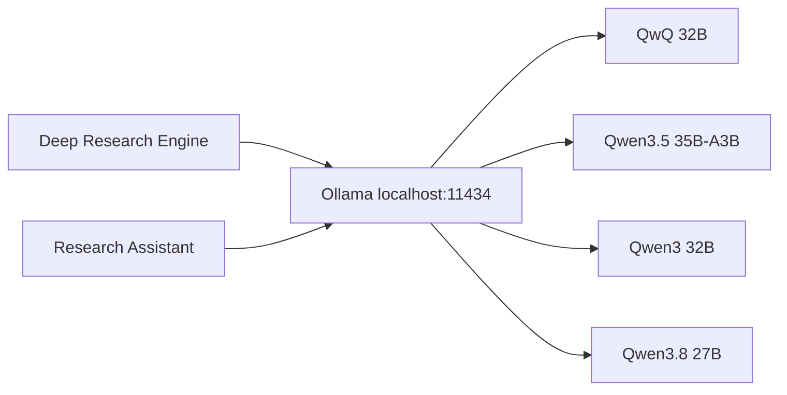

The default Ollama endpoint is:

```env
OLLAMA_BASE_URL=http://127.0.0.1:11434
```

The Research Assistant and the local Deep Research workflow therefore assume Ollama is running on the same machine.

Do not expose port `11434` directly to the Internet.

---

# 8. Python environment and dependencies

The shared `requirements.txt` is the canonical Python dependency file for **both applications**.

On a fresh machine, the recommended command is:

```bash
./setup.sh
```

The setup script installs the required Python packages from this file after creating the project virtual environment.

If you are installing manually:

```bash
source .venv/bin/activate
python -m pip install --upgrade pip setuptools wheel
pip install -r requirements.txt
```

The shared `requirements.txt` contains the core stack:

```text
langchain
langgraph
langchain-ollama
langchain-core
ollama
ddgs
requests
trafilatura
beautifulsoup4
rapidfuzz
python-dotenv
PyYAML
pydantic
reportlab
PyMuPDF
pypdf
pytesseract
Pillow
fonttools
```

The roles are:

| Dependency | Purpose |
|---|---|
| LangChain / LangGraph | local agent/tool orchestration |
| `langchain-ollama` | Ollama model integration |
| `ollama` | Ollama client utilities |
| `ddgs` | general web search |
| `requests` | HTTP/API calls |
| `trafilatura` | webpage text extraction |
| `beautifulsoup4` | HTML parsing |
| `rapidfuzz` | fuzzy matching / retrieval support |
| `python-dotenv` | `.env` configuration |
| `PyYAML` | document-library YAML configuration |
| `pydantic` | structured models |
| `reportlab` | final PDF generation |
| `PyMuPDF` | PDF access and verification / OCR rendering |
| `pypdf` | native PDF text extraction |
| `pytesseract` | OCR interface |
| `Pillow` | image validation and OCR images |
| `fonttools` | PDF font parsing support |

---

# 9. Configuration files

There are two primary environment files.

## 9.1 Deep Research Engine

```text
.env.deep_research_engine
```

The engine source loads this file directly.

## 9.2 Research Assistant

```text
.env.research_assistant
```

The assistant uses this file by default. You can override the path with:

```env
RESEARCH_ASSISTANT_ENV_FILE=/path/to/custom.env
```

## 9.3 Why configuration is split

The two applications solve different problems.

```text
Deep Research Engine
    ├── huge literature-search workload
    ├── many research tasks
    ├── scholarly APIs
    ├── deep synthesis
    └── PDF report generation

Research Assistant
    ├── interactive conversation
    ├── saved research follow-up
    ├── personal document RAG
    ├── image understanding
    └── lightweight web follow-up
```

Combining all configurations into one `.env` makes tuning and troubleshooting much harder.

---

# 10. Deep Research Engine

## 10.1 Purpose

The Deep Research Engine is a **multi-pass research pipeline**, not a single search-and-answer agent.

Its purpose is to produce a defensible technical literature review from a question that may require:

- broad literature discovery
- multiple search formulations
- paper deduplication
- citation expansion
- technical-web research
- deep paper analysis
- evidence synthesis
- adversarial review
- alternate-terminology search
- final scientific review
- PDF generation

It deliberately separates:

```text
discovery
   ↓
selection
   ↓
deep reading
   ↓
synthesis
   ↓
critique
   ↓
gap search
   ↓
post-gap analysis
   ↓
final synthesis
   ↓
review
   ↓
PDF
```

## 10.2 Model roles

The default roles are:

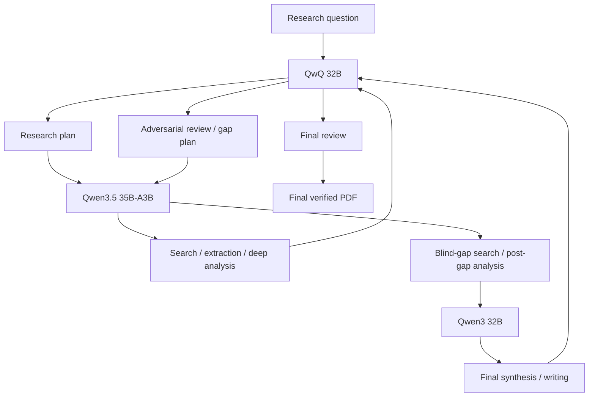

The engine configuration maps:

```env
PLANNER_MODEL=qwq:32b
SEARCH_STRATEGIST_MODEL=qwen3.5:35b-a3b
RESEARCH_MODEL=qwen3.5:35b-a3b
DEEP_ANALYSER_MODEL=qwen3.5:35b-a3b
BLIND_RESEARCH_MODEL=qwen3.5:35b-a3b
CRITIC_MODEL=qwq:32b
GAP_MODEL=qwen3.5:35b-a3b
WRITER_MODEL=qwen3:32b
```

## 10.3 Deep mode

Deep mode is the normal, high-coverage research workflow.

Default settings:

```text
minimum candidates/task     150
discovery target/task       225
deep reads/task              50
academic queries/task        20
web queries/task             12
blind-gap queries/task       20
search pages                  3
citation hubs                12
web deep-read               enabled
```

Important:

**150 candidate papers do not mean the engine fully reads 150 papers.**

The engine first builds a broad candidate corpus, deduplicates/ranks it, and then deeply analyses the top configured subset.

Conceptually:

```text
225 discovered records
        ↓
deduplication
        ↓
150+ candidate records
        ↓
relevance ranking
        ↓
Top 50 deep-read
        ↓
evidence cards
```

The minimum is a target for unique candidates, where the literature supports that volume. The engine does not fabricate or pad the corpus.

## 10.4 Short mode

Short mode is the compact end-to-end evidence scan.

Default settings:

```text
minimum candidates/task      20
discovery target/task        30
deep reads/task               5
academic queries/task         5
web queries/task              3
blind-gap queries/task        5
search pages                  1
citation hubs                 3
maximum web results           5
web deep-read             disabled
```

Use it when you want to:

- test the complete pipeline
- get a fast evidence scan
- check whether your topic is retrieving relevant literature
- develop/debug a research question before launching a large run

## 10.5 Smoke test

Run:

```bash
python deep_research_engine.py --smoke-test
```

The smoke test checks:

1. Ollama executable and required models
2. general web search
3. Semantic Scholar when enabled
4. OpenAlex

It is not a substitute for a full research run, but it is the quickest way to detect a broken local installation or missing model.

## 10.6 Full workflow

The actual run contains these major stages:

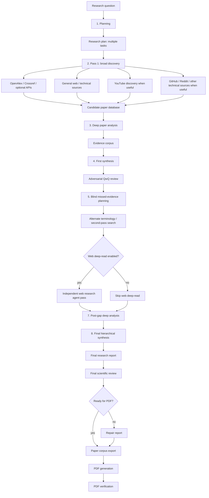

### Stage 1 — Planning

The planner divides the research question into several independent research tasks.

Each task can contain:

- objective
- scope notes
- search concepts
- inclusion criteria
- exclusion criteria

This allows a large question to be decomposed before searching begins.

### Stage 2 — Broad discovery

Each task generates multiple scholarly and web queries.

The engine uses the candidate-paper database to collect and deduplicate records.

### Stage 3 — Deep paper analysis

The strongest subset is deeply analysed.

The engine builds structured evidence cards rather than sending the entire candidate corpus into one enormous prompt.

### Stage 4 — First synthesis and adversarial review

A first synthesis is created.

Then QwQ is asked to identify:

- missing evidence
- weak claims
- contradictions
- insufficient coverage
- terminology gaps
- research blind spots

### Stage 5 — Blind missed-evidence search

The second search pass intentionally does not rely only on the vocabulary used in the first pass.

It creates alternate search plans and looks for:

- different terminology
- adjacent communities
- overlooked methods
- alternative research families
- missing evidence

### Stage 6 — Optional web research agent pass

Controlled by:

```env
DEEP_RUN_WEB_DEEP_READ=true
```

This is enabled by default in Deep mode and disabled by default in Short mode.

### Stage 7 — Post-gap deep analysis

The candidate corpus is re-analysed after the blind-gap search.

### Stage 8 — Final synthesis

The engine performs hierarchical synthesis:

```text
paper evidence
    ↓
task-level synthesis
    ↓
global synthesis
    ↓
final writer
```

This is intentionally hierarchical because the complete multi-task evidence corpus is too large to place into a single local context window.

### Final review

QwQ reviews the complete report.

If the report is not ready for PDF generation, the engine performs one final repair pass.

### PDF generation

The final report is written to:

```text
deep_research_YYYYMMDD_HHMMSS.pdf
```

and a verification record is saved under the run directory.

## 10.7 Search and evidence architecture

The current scholarly/technical source families include:

```text
Scholarly:
  OpenAlex
  Crossref
  Semantic Scholar (optional)
  OpenAIRE
  DBLP
  arXiv

Technical / community:
  GitHub
  Reddit
  general web search
  YouTube discovery

Optional:
  Google Scholar through SerpApi
  Unpaywall for DOI → open-access resolution
```

The engine uses source-specific throttling, retries, backoff, and fail-soft behaviour.

If one provider repeatedly fails, it can be disabled for the remainder of the run while other sources continue.

### Evidence hierarchy

The final report should generally distinguish:

```text
Primary / peer-reviewed study
        ↓
Official technical documentation / standard / report
        ↓
University / research group material
        ↓
Technical demonstrations / talks
        ↓
General web pages / informal sources
```

YouTube and general websites can be useful discovery material, but they should not automatically be treated as substitutes for primary scholarly evidence.

## 10.8 Hierarchical synthesis

The engine explicitly limits evidence passed into local-model contexts.

Important controls:

```env
SYNTHESIS_TASK_INPUT_CHARS=30000
SYNTHESIS_TASK_SUMMARY_CHARS=6500
SYNTHESIS_GLOBAL_INPUT_CHARS=60000
SYNTHESIS_FINAL_INPUT_CHARS=24000
```

The intent is:

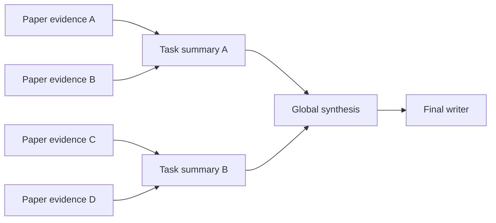

This reduces context explosion and makes the synthesis stages easier to inspect.

## 10.9 Adversarial and blind-gap passes

These are important because a simple search agent often stops too early.

The adversarial stage asks:

> What is weak, missing, contradictory, unsupported, or under-researched?

The blind-gap stage then searches again using alternate terminology.

This creates an intentional feedback loop:

```text
first search
   ↓
first synthesis
   ↓
critique
   ↓
gap plan
   ↓
new search vocabulary
   ↓
post-gap evidence
   ↓
final synthesis
```

## 10.10 Final review and PDF generation

Before the report becomes the final PDF:

1. final report is written
2. final scientific review is run
3. repair is performed if necessary
4. references are appended
5. paper corpus is exported to CSV
6. PDF is generated
7. PDF is verified
8. run summary is written

Typical run directory:

```text
runs/20260923_120000/
├── research_plan.json
├── pass1_summary.json
├── papers.sqlite
├── paper_corpus.csv
├── first_synthesis.md
├── critique.json
├── blind_gap_summary.json
├── gap_plans.json
├── web_agent_outputs.json
├── evidence_cards_post_gap.json
├── task_summaries_post_gap.json
├── final_report.md
├── final_review.json
├── repaired_report.md          # only if repair was needed
├── pdf_verification.json
└── run_summary.json
```

## 10.11 Engine command reference

### Full Deep mode

```bash
./run_research.sh "your research question"
```

Equivalent:

```bash
python deep_research_engine.py --mode deep "your research question"
```

Deep is the default if no mode is provided.

### Short mode

```bash
./run_research.sh --mode short "your research question"
```

or:

```bash
python deep_research_engine.py --short-research "your research question"
```

`--short-research` is an alias for `--mode short`.

### Help

```bash
python deep_research_engine.py --help
```

### Smoke test

```bash
python deep_research_engine.py --smoke-test
```

## 10.12 Engine environment variables

### Models

```env
PLANNER_MODEL=qwq:32b
SEARCH_STRATEGIST_MODEL=qwen3.5:35b-a3b
RESEARCH_MODEL=qwen3.5:35b-a3b
DEEP_ANALYSER_MODEL=qwen3.5:35b-a3b
BLIND_RESEARCH_MODEL=qwen3.5:35b-a3b
CRITIC_MODEL=qwq:32b
GAP_MODEL=qwen3.5:35b-a3b
WRITER_MODEL=qwen3:32b
```

Change these only when another installed Ollama model is intentionally assigned to that role.

### Deep workload

```env
DEEP_MIN_CANDIDATE_PAPERS=150
DEEP_DISCOVERY_TARGET=225
DEEP_PAPERS_TO_DEEP_READ=50
DEEP_MAX_LLM_CONCURRENCY=1
DEEP_MAX_TASK_CONCURRENCY=1
DEEP_SEARCH_QUERY_COUNT=20
DEEP_WEB_QUERY_COUNT=12
DEEP_BLIND_QUERY_COUNT=20
DEEP_MAX_SEARCH_PAGES=3
DEEP_MAX_CITATION_HUBS=12
DEEP_RUN_WEB_DEEP_READ=true
```

Use these controls when you need to trade coverage against runtime.

### Short workload

```env
SHORT_MIN_CANDIDATE_PAPERS=20
SHORT_DISCOVERY_TARGET=30
SHORT_PAPERS_TO_DEEP_READ=5
SHORT_MAX_LLM_CONCURRENCY=1
SHORT_MAX_TASK_CONCURRENCY=1
SHORT_SEARCH_QUERY_COUNT=5
SHORT_WEB_QUERY_COUNT=3
SHORT_BLIND_QUERY_COUNT=5
SHORT_MAX_SEARCH_PAGES=1
SHORT_MAX_CITATION_HUBS=3
SHORT_MAX_WEB_RESULTS=5
SHORT_RUN_WEB_DEEP_READ=false
```

### Shared content limits

```env
DEEP_MAX_WEB_RESULTS=10
PDF_MAX_CHARS=160000
WEB_MAX_CHARS=90000
```

### LLM runtime

```env
LLM_HEARTBEAT_SECONDS=15
LLM_RETRIES=2
LLM_HTTP_TIMEOUT_SECONDS=1800

LLM_CTX_DEFAULT=16384
LLM_CTX_DEEP=24576
LLM_CTX_SYNTHESIS=24576
LLM_CTX_WRITER=24576
LLM_CTX_TASK_SYNTHESIS=16384

LLM_TOKENS_PLANNER=4096
LLM_TOKENS_SEARCH=2048
LLM_TOKENS_SOURCE=1024
LLM_TOKENS_PAPER=4096
LLM_TOKENS_CRITIC=4096
LLM_TOKENS_GAP=3072
LLM_TOKENS_TASK_SYNTHESIS=3000
LLM_TOKENS_SYNTHESIS=5000
LLM_TOKENS_WRITER=7000
LLM_TOKENS_REVIEW=3072
LLM_TOKENS_WEB=4096
LLM_TOKENS_REPAIR=7000
```

These are the major runtime controls for latency and output size.

### Reasoning behaviour

```env
LLM_REASONING_PLANNER=native
LLM_REASONING_SEARCH=false
LLM_REASONING_SOURCE=false
LLM_REASONING_PAPER=false
LLM_REASONING_CRITIC=native
LLM_REASONING_GAP=native
LLM_REASONING_REVIEW=native
LLM_REASONING_WRITER=false
```

The current design keeps reasoning enabled for QwQ-style planning/critique roles while avoiding unnecessary reasoning overhead in the high-volume Qwen3.5/Qwen3 stages.

### Provider switches

```env
OPENALEX_ENABLED=true
OPENAIRE_ENABLED=true
DBLP_ENABLED=true
ARXIV_ENABLED=true
GITHUB_ENABLED=true
REDDIT_ENABLED=true
GOOGLE_SCHOLAR_ENABLED=false
UNPAYWALL_ENABLED=true
SEMANTIC_SCHOLAR_ENABLED=true
ENABLE_YOUTUBE=true
```

### Optional credentials

```env
OPENALEX_API_KEY=
SEMANTIC_SCHOLAR_API_KEY=
SERPAPI_API_KEY=
GITHUB_TOKEN=
YOUTUBE_API_KEY=
UNPAYWALL_EMAIL=
OPENALEX_MAILTO=
CROSSREF_MAILTO=
```

The engine can still work without most of these, using anonymous/public access where supported.

### API reliability controls

The engine supports provider-specific:

- minimum intervals
- retries
- backoff
- automatic disable-after-failures

The source contains settings for Semantic Scholar, OpenAlex, OpenAIRE, DBLP, arXiv, GitHub, Reddit, and Google Scholar.

You normally do **not** need to change these.

---

# 11. Research Assistant

## 11.1 Purpose

The Research Assistant is the interactive layer.

It is designed for questions that do not justify launching the full Deep Research Engine every time.

It can:

- chat locally
- optionally search the web
- continue work from completed research runs
- search your saved research evidence
- answer from your personal document library
- OCR scanned PDFs
- inspect images
- combine image evidence with documents/research/web evidence
- launch the Deep Research Engine from the same terminal session
- preserve scoped conversation memory

## 11.2 Three intention categories

At startup:

```text
What do you want to do?
  1. Normal chat
  2. Research
  3. Document understanding
```

The current source defines:

```text
CHAT
RESEARCH
DOCUMENT_UNDERSTANDING
```

The selected intention determines which context sources are eligible.

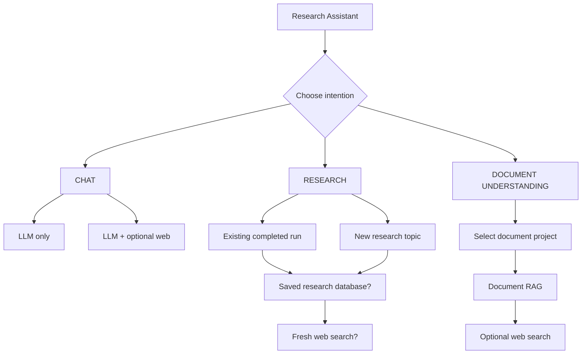

## 11.3 Normal Chat

Normal Chat asks whether you want:

```text
LLM only
```

or:

```text
LLM + web search
```

Configuration:

```env
CHAT_CATEGORY_ENABLED=true
CHAT_ALLOW_WEB_SEARCH=true
CHAT_DEFAULT_WEB_SEARCH=false
```

Typical behaviour:

### LLM-only

```text
Question
   ↓
Conversation memory
   ↓
Qwen3.5
   ↓
Answer
```

No fresh web evidence is claimed.

### Chat + Web

```text
Question
   ├── Qwen3.5 query planning
   ├── web search
   └── external evidence
           ↓
       Qwen3.5 answer
```

The Web setting persists for the current Chat intention and can be toggled with `w`.

## 11.4 Research

Research has two paths:

```text
1. Existing completed research project
2. New research topic
```

### Existing research project

The assistant lets you select a completed Deep Research run.

It can then use:

- the saved paper corpus
- evidence from the selected run
- fresh web research, if enabled
- conversation memory

### New research topic

The assistant creates a new topic that is not initially tied to one existing run.

It can search across saved completed research projects and/or use fresh web search.

### Research questions

You are asked:

```text
Include the saved research database? [yes/no]
```

and:

```text
Keep fresh web search active? [yes/no]
```

Configuration:

```env
RESEARCH_ALLOW_DATABASE=true
RESEARCH_DEFAULT_DATABASE=true

RESEARCH_ALLOW_WEB_SEARCH=true
RESEARCH_DEFAULT_WEB_SEARCH=true

RESEARCH_DATABASE_MAX_PROJECTS=20
```

### Research information flow

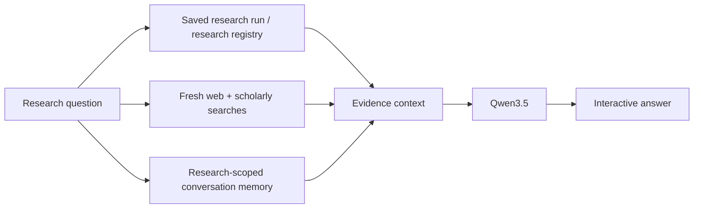

## 11.5 Document Understanding

Document Understanding is designed for:

- PDFs
- scanned PDFs
- DOCX
- TXT
- Markdown

You select a project:

```text
1. ROV_Control
2. AEROSUB
3. Thesis
4. General
0. None
```

Then you choose whether to also use web search.

Configuration:

```env
DOCUMENTS_CATEGORY_ENABLED=true
DOCUMENTS_ALLOW_WEB_SEARCH=true
DOCUMENTS_DEFAULT_WEB_SEARCH=false
DOCUMENTS_REQUIRE_PROJECT=true
```

### Document-only behaviour

When Web is OFF:

```text
Question
   ↓
selected project
   ↓
local RAG
   ↓
Qwen3.5
   ↓
answer with [DOC-*] citations
```

If the selected document project does not support the answer, the assistant is instructed not to silently fill the gap from outside knowledge.

### Documents + Web

```text
Question
   ├── local document RAG
   └── fresh web search
           ↓
      Qwen3.5 synthesis
```

The answer keeps local document evidence and web evidence distinguishable.

## 11.6 Document RAG architecture

The RAG stack is:

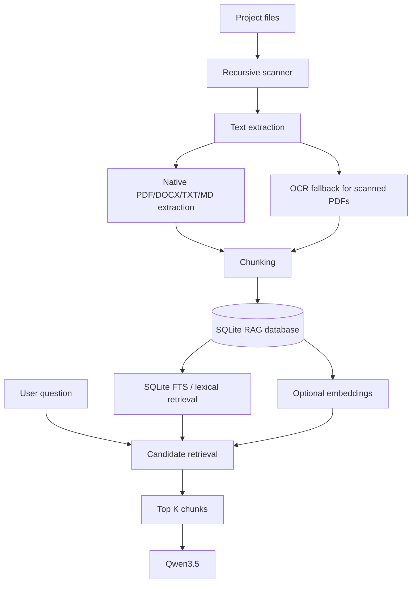

Default RAG settings:

```env
RAG_TOP_K=10
RAG_CANDIDATE_K=40
RAG_CHUNK_SIZE=1800
RAG_CHUNK_OVERLAP=250
RAG_MAX_FILE_MB=80
RAG_INDEX_ON_START=false
```

### Retrieval

The system:

1. scans the selected project
2. retrieves lexical candidates
3. optionally combines embedding similarity
4. scores candidate chunks
5. returns the top K
6. passes those chunks into the answer model

When embeddings are disabled, lexical/BM25-style retrieval is used.

When embeddings are enabled:

```env
RAG_EMBEDDINGS_ENABLED=true
RAG_EMBEDDING_MODEL=nomic-embed-text
```

the retriever combines lexical and vector evidence.

## 11.7 PDF extraction and OCR

The PDF pipeline first tries native extraction with `pypdf`.

If the PDF is scanned or has too little native text, the assistant can render pages through PyMuPDF and run Tesseract OCR.

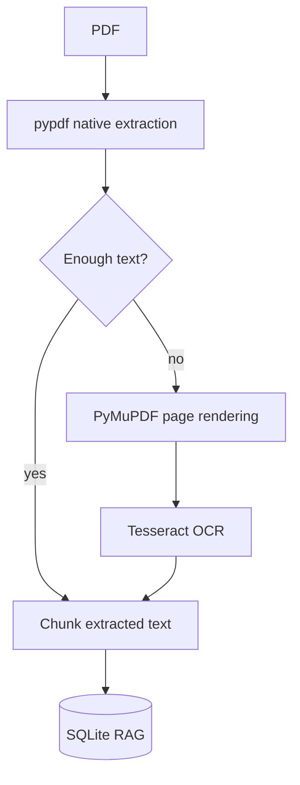

Current OCR settings:

```env
RAG_OCR_ENABLED=true
RAG_OCR_DPI=180
RAG_OCR_LANG=eng
RAG_OCR_MIN_PAGE_CHARS=80
RAG_OCR_MIN_NATIVE_COVERAGE=0.65
RAG_OCR_MAX_PAGES=0
RAG_OCR_TIMEOUT_SECONDS=120
RAG_VERBOSE_LOGGING=false
```

Meaning:

| Variable | Meaning |
|---|---|
| `RAG_OCR_ENABLED` | enable/disable OCR fallback |
| `RAG_OCR_DPI` | PDF rendering resolution for OCR |
| `RAG_OCR_LANG` | Tesseract language |
| `RAG_OCR_MIN_PAGE_CHARS` | pages below this amount may be OCR'd |
| `RAG_OCR_MIN_NATIVE_COVERAGE` | if native coverage is low, more pages are OCR'd |
| `RAG_OCR_MAX_PAGES` | OCR page limit; `0` means unlimited |
| `RAG_OCR_TIMEOUT_SECONDS` | per-page OCR timeout |
| `RAG_VERBOSE_LOGGING` | detailed RAG diagnostics; keep false for normal use |

The system also stores:

```text
page_count
chunk_count
extraction_method
status
```

so document indexing can be inspected.

### Retry behaviour

Incomplete/legacy documents with zero chunks can be retried even if the file itself has not changed.

This is important for previously failed scans.

## 11.8 Multimodal image understanding

Images live under:

```text
images/
```

The launcher creates this automatically.

Recommended organization:

```text
images/
├── ROV/
├── AEROSUB/
├── Thesis/
└── General/
```

The assistant recursively scans this folder.

Supported image types:

```text
.jpg
.jpeg
.png
.webp
.bmp
.gif
.tif
.tiff
```

Default limits:

```env
VISION_MAX_IMAGE_MB=20
VISION_MAX_IMAGES=4
```

### Attach an image

Type:

```text
img
```

The assistant displays numbered images.

You can enter:

- a number
- a filename/path
- an absolute path

For example:

```text
Image: 1
```

or:

```text
Image: ROV/controller.png
```

or:

```text
Image: /home/user/path/to/figure.png
```

### Remove attached images

```text
clear-image
```

Starting a new topic with `n` also clears attached images.

### Visual pipeline

The current serial design is:

```mermaid
flowchart LR
    IMG[Attached image(s)] --> V[Qwen3.8:27b]
    V --> EV[Visual Evidence Report]

    EV --> E{Other evidence}
    DOC[PDF / document RAG] --> E
    RES[Saved research] --> E
    WEB[Fresh web] --> E
    E --> A[Qwen3.5:35b-a3b]
    A --> OUT[Final answer]
```

The vision model is explicitly told to separate:

```text
OBSERVED
INFERRED
UNCERTAIN / NOT VISIBLE
```

This matters because the final model should not convert uncertain visual interpretation into fact.

### Vision configuration

Recommended current settings:

```env
VISION_ENABLED=true
VISION_MODEL=qwen3.8:27b
VISION_CTX=12288
VISION_TOKENS=2000
VISION_THINK=true
VISION_TIMEOUT_SECONDS=1200
VISION_MAX_IMAGE_MB=20
VISION_MAX_IMAGES=4
VISION_SERIAL=true
VISION_SAVE_EVIDENCE=true
```

`VISION_THINK=true` keeps Qwen3.8 reasoning enabled.

`VISION_TOKENS` is a generation budget and is intentionally lower than the main answer budget to reduce unnecessary visual-stage output.

`VISION_SERIAL=true` sends the vision request with `keep_alive=0`, allowing the visual model to be released before the Qwen3.5 answer stage.

### Trace files

Image-enabled questions save:

```text
attached_images.json
visual_analysis.md
```

inside the question trace directory.

This lets you inspect exactly what the visual model passed downstream.

## 11.9 Web-search control

The Research Assistant does not permanently force web search.

Web search is controlled separately by intention.

### Chat

```text
w
```

toggles Chat web search.

### Research

The research setup asks whether fresh web search should remain active.

### Documents

The document setup asks whether web search should supplement the local documents.

### Important behaviour

If Web is ON but the web service becomes unavailable for a question:

- the question can still be answered from available local/context evidence
- the assistant records a web-access note
- the persistent Web setting remains ON for the next question

A temporary network failure should not permanently change the user's setting.

## 11.10 Memory and topic scoping

The Research Assistant uses intention/project-scoped memory rather than one global conversation buffer.

Scopes include:

```text
chat
research:<run>
research:new:<topic>
documents:<project>
```

Conceptually:

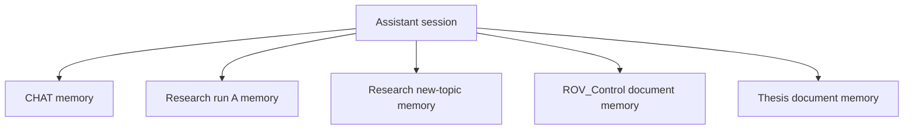

This prevents:

- research discussion leaking into normal chat
- document-project conversation leaking into a different document project
- one research project contaminating another

Starting a new topic with `n` resets the active topic memory while preserving the selected intention and its relevant Web/database settings.

## 11.11 Deep Research integration

The Research Assistant can launch the Deep Research Engine from the same terminal.

Command:

```text
deep
```

The assistant:

1. saves its current conversation scope
2. builds a self-contained research question from the current discussion
3. launches `deep_research_engine.py`
4. passes the configured Deep/Short mode
5. waits for completion
6. refreshes the research registry
7. attaches the completed run to the Research Assistant
8. switches into Research intention
9. returns to the interactive session

Diagram:

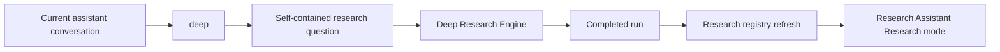

Configuration:

```env
DEEP_RESEARCH_ENGINE_SCRIPT=deep_research_engine.py
DEEP_RESEARCH_ENGINE_MODE=deep
DEEP_RESEARCH_PASS_MODE=true
DEEP_RESEARCH_AUTO_RESUME=true
DEEP_RESEARCH_WORKING_DIR=
```

Use:

```env
DEEP_RESEARCH_ENGINE_MODE=short
```

when you want the assistant's `deep` command to launch the Short research workload instead.

## 11.12 Terminal command reference

The session header shows the current commands.

| Command | Function |
|---|---|
| `i` | change intention |
| `img` | attach an image |
| `clear-image` | remove all attached images |
| `w` | toggle Web for the current intention |
| `p` | change research/document project |
| `docs` | open document manager |
| `sync` | scan/index document projects |
| `deep` | launch Deep Research |
| `n` | start a new topic |
| `q` | quit |

Additional CLI options:

```bash
python research_assistant.py --help
```

Supported arguments include:

```text
--project <run>
--doc-project <name>
--intention CHAT|RESEARCH|DOCUMENT_UNDERSTANDING
--mode <legacy-mode>
--quick
--no-interactive
--local-only
--deep-mode short|deep
--self-test
```

Legacy mode values are mapped into the newer three-intention system.

### Self-test

```bash
python research_assistant.py --self-test
```

This reports:

- assistant environment path
- document YAML
- RAG database path
- Ollama endpoint
- active query/answer models
- RAG embedding setting
- RAG verbose logging
- enabled categories
- Deep Research engine path
- Deep Research mode
- auto-resume setting
- Ollama connectivity

## 11.13 Assistant environment variables

### Ollama

```env
OLLAMA_BASE_URL=http://127.0.0.1:11434
```

Change this only if the local Ollama endpoint is intentionally moved.

### Startup and categories

```env
ASSISTANT_ASK_INTENTION_ON_START=true

CHAT_CATEGORY_ENABLED=true
RESEARCH_CATEGORY_ENABLED=true
DOCUMENTS_CATEGORY_ENABLED=true
```

Set a category to `false` if you want to hide it from the startup intention menu.

### Chat

```env
CHAT_ALLOW_WEB_SEARCH=true
CHAT_DEFAULT_WEB_SEARCH=false
```

Recommended default: keep Web available, but start Chat in LLM-only mode.

### Research

```env
RESEARCH_ALLOW_DATABASE=true
RESEARCH_DEFAULT_DATABASE=true

RESEARCH_ALLOW_WEB_SEARCH=true
RESEARCH_DEFAULT_WEB_SEARCH=true

RESEARCH_DATABASE_MAX_PROJECTS=20
```

### Documents

```env
DOCUMENTS_ALLOW_WEB_SEARCH=true
DOCUMENTS_DEFAULT_WEB_SEARCH=false
DOCUMENTS_REQUIRE_PROJECT=true
```

For a document-only research workflow, set:

```env
DOCUMENTS_DEFAULT_WEB_SEARCH=false
```

### Conversation models

```env
FOLLOWUP_QUERY_MODEL=qwen3.5:35b-a3b
FOLLOWUP_ANSWER_MODEL=qwen3.5:35b-a3b

FOLLOWUP_QUERY_CTX=6144
FOLLOWUP_QUERY_TOKENS=700

FOLLOWUP_ANSWER_CTX=12288
FOLLOWUP_ANSWER_TOKENS=2500

FOLLOWUP_LLM_HEARTBEAT=15
FOLLOWUP_LLM_TIMEOUT_SECONDS=1200
```

### Conversation summarization

```env
FOLLOWUP_SUMMARY_MODEL=qwen3.5:35b-a3b
FOLLOWUP_SUMMARY_CTX=8192
FOLLOWUP_SUMMARY_TOKENS=1800
FOLLOWUP_CONVERSATION_SUMMARY_CHARS=6000
FOLLOWUP_CONVERSATION_HISTORY_CHARS=12000
FOLLOWUP_CONVERSATION_RECENT_TURNS=4
FOLLOWUP_CONVERSATION_SUMMARIZE_AFTER_TURNS=4
```

### Quick/new-topic research search

```env
QUICK_QUERY_MODEL=qwen3.5:35b-a3b
QUICK_ANSWER_MODEL=qwen3.5:35b-a3b
QUICK_QUERY_CTX=8192
QUICK_QUERY_TOKENS=1000
QUICK_ANSWER_CTX=12288
QUICK_ANSWER_TOKENS=2500
QUICK_RESULTS_PER_SOURCE=4
QUICK_MAX_WORKERS=4
QUICK_MAX_SOURCE_FAMILIES=6
QUICK_CONTEXT_CHARS=30000
```

### Saved-research and external retrieval

```env
FOLLOWUP_ALWAYS_REFRESH=true
FOLLOWUP_RECENT_DAYS=7
FOLLOWUP_REGISTRY_PAGE_SIZE=10
FOLLOWUP_LOCAL_PAPER_RESULTS=6
FOLLOWUP_LOCAL_EVIDENCE_RESULTS=8
FOLLOWUP_LOCAL_TECH_RESULTS=6
FOLLOWUP_EXTERNAL_RESULTS_PER_SOURCE=3
FOLLOWUP_EXTERNAL_MAX_WORKERS=4
FOLLOWUP_QUERIES_PER_FAMILY=1
FOLLOWUP_CONTEXT_CHARS=30000
```

### RAG

```env
RAG_EMBEDDINGS_ENABLED=false
RAG_EMBEDDING_MODEL=nomic-embed-text

RAG_TOP_K=10
RAG_CANDIDATE_K=40
RAG_CHUNK_SIZE=1800
RAG_CHUNK_OVERLAP=250
RAG_MAX_FILE_MB=80
RAG_INDEX_ON_START=false
```

### OCR

```env
RAG_OCR_ENABLED=true
RAG_OCR_DPI=180
RAG_OCR_LANG=eng
RAG_OCR_MIN_PAGE_CHARS=80
RAG_OCR_MIN_NATIVE_COVERAGE=0.65
RAG_OCR_MAX_PAGES=0
RAG_OCR_TIMEOUT_SECONDS=120
RAG_VERBOSE_LOGGING=false
```

### Vision

```env
VISION_ENABLED=true
VISION_MODEL=qwen3.8:27b
VISION_CTX=12288
VISION_TOKENS=2000
VISION_THINK=true
VISION_TIMEOUT_SECONDS=1200
VISION_MAX_IMAGE_MB=20
VISION_MAX_IMAGES=4
VISION_SERIAL=true
VISION_SAVE_EVIDENCE=true
```

### Deep Research integration

```env
DEEP_RESEARCH_ENGINE_SCRIPT=deep_research_engine.py
DEEP_RESEARCH_ENGINE_MODE=deep
DEEP_RESEARCH_PASS_MODE=true
DEEP_RESEARCH_AUTO_RESUME=true
DEEP_RESEARCH_WORKING_DIR=
```

### Optional external API credentials

```env
SERPAPI_API_KEY=
YOUTUBE_API_KEY=
GITHUB_TOKEN=
OPENALEX_API_KEY=
SEMANTIC_SCHOLAR_API_KEY=
SEMANTIC_SCHOLAR_ENABLED=true

RESEARCH_USER_AGENT=LocalResearchAssistant/1.0 (personal academic research tool)
```

---

# 12. Document library setup

The document library is defined by:

```text
document_library.yaml
```

Current projects:

```yaml
projects:
  ROV_Control:
    folders:
      - "documents/ROV_Control"
    recursive: true

  AEROSUB:
    folders:
      - "documents/AEROSUB"
    recursive: true

  Thesis:
    folders:
      - "documents/Thesis"
    recursive: true

  General:
    folders:
      - "documents/General"
    recursive: true
```

The scanner recursively discovers:

```text
.pdf
.docx
.txt
.md
```

inside project folders.

## Add a document

Copy it into the appropriate folder.

For example:

```text
documents/ROV_Control/my_controller_paper.pdf
```

Then run:

```text
sync
```

or use:

```text
docs
```

and choose a scan operation.

## When to use `sync`

Run `sync` after:

- adding documents
- replacing documents
- editing `.docx`, `.txt`, or `.md`
- deleting documents
- adding scanned PDFs
- changing OCR settings when you want reprocessing

You do **not** need to run `sync` before every question.

The index tracks:

```text
path
size
mtime
SHA256
page count
chunk count
extraction method
status
```

so unchanged documents can be reused.

## Document manager

Run:

```text
docs
```

The manager provides:

```text
1. Scan all projects
2. Scan current project
3. Show indexed documents
4. Change document project
5. Add project/folder to YAML
q. Back
```

---

# 13. Image library setup

The Research Assistant launcher creates:

```text
images/
```

automatically.

Recommended structure:

```text
images/
├── ROV/
│   ├── controller.png
│   ├── thruster_mapping.png
│   └── mocap_setup.jpg
├── AEROSUB/
├── Thesis/
└── General/
```

The `img` command recursively lists images.

You can also attach a file outside this folder with its absolute path.

The image validator checks:

- file exists
- supported extension
- file size
- image validity via Pillow

Maximum default file size:

```env
VISION_MAX_IMAGE_MB=20
```

Maximum number of simultaneous attached images:

```env
VISION_MAX_IMAGES=4
```

---

# 14. Running both applications

## 14.1 Deep Research Engine

From the repository:

```bash
./run_research.sh "your research question"
```

## 14.2 Research Assistant

```bash
./run_research_assistant.sh
```

The assistant launcher:

1. changes to the repository directory
2. activates `.venv`
3. creates document folders
4. creates `images/`
5. launches `research_assistant.py`

## 14.3 Direct Python execution

You can also run:

```bash
source .venv/bin/activate
python deep_research_engine.py --mode short "your question"
```

or:

```bash
python research_assistant.py
```

---

# 15. Recommended configuration for a 16 GB GPU

The safest starting point is:

```text
Deep Research Engine:
    LLM concurrency = 1
    task concurrency = 1

Research Assistant:
    one large answer request at a time
    serial vision
```

## Model residency

The Research Assistant deliberately makes vision serial:

```text
Qwen3.8 vision stage
        ↓
release vision model
        ↓
Qwen3.5 answer stage
```

This prevents the 27B vision model and the 35B answer model from unnecessarily competing for GPU/RAM at the same time.

## If Deep Research is too slow

Use Short mode:

```bash
./run_research.sh --mode short "your question"
```

Or reduce:

```env
DEEP_PAPERS_TO_DEEP_READ=20
DEEP_DISCOVERY_TARGET=175
```

For maximum stability:

```env
DEEP_MAX_LLM_CONCURRENCY=1
DEEP_MAX_TASK_CONCURRENCY=1
```

## If the system becomes memory-bound

Do not immediately increase concurrency.

First:

```env
DEEP_MAX_LLM_CONCURRENCY=1
DEEP_MAX_TASK_CONCURRENCY=1
```

and ensure no unnecessary Ollama models are being held resident.

---

# 16. API keys and optional providers

The architecture is designed to work with public/anonymous sources where possible.

## OpenAlex

No API key is required for basic use.

Optional:

```env
OPENALEX_API_KEY=
OPENALEX_MAILTO=your@email.com
```

## Crossref

Optional contact address:

```env
CROSSREF_MAILTO=your@email.com
```

## Semantic Scholar

The engine supports Semantic Scholar with retry/backoff/fail-soft behaviour.

```env
SEMANTIC_SCHOLAR_ENABLED=true
SEMANTIC_SCHOLAR_API_KEY=
```

If rate limiting becomes persistent, set:

```env
SEMANTIC_SCHOLAR_ENABLED=false
```

The rest of the engine can continue with other scholarly sources.

## Google Scholar

Direct scraping is intentionally not used.

The engine can use an optional third-party structured API such as SerpApi:

```env
GOOGLE_SCHOLAR_ENABLED=false
SERPAPI_API_KEY=
```

To enable:

```env
GOOGLE_SCHOLAR_ENABLED=true
SERPAPI_API_KEY=your_key
```

## GitHub

Optional:

```env
GITHUB_ENABLED=true
GITHUB_TOKEN=
```

A token can provide better authenticated limits.

## YouTube

Optional:

```env
ENABLE_YOUTUBE=true
YOUTUBE_API_KEY=
```

Without a YouTube API key, the engine can still discover YouTube material through web search.

## Unpaywall

Used for DOI → open-access resolution:

```env
UNPAYWALL_ENABLED=true
UNPAYWALL_EMAIL=your@email.com
```

---

# 17. Understanding generated data

## 17.1 Deep Research `runs/`

Each run is isolated:

```text
runs/YYYYMMDD_HHMMSS/
```

Important artifacts:

```text
research_plan.json
    planning output and task decomposition

papers.sqlite
    structured paper database

paper_corpus.csv
    readable paper export

first_synthesis.md
    first synthesis before blind-gap critique

critique.json
    adversarial review

gap_plans.json
    blind-gap search plans

evidence_cards.json
    deep evidence corpus

evidence_cards_post_gap.json
    post-gap evidence corpus

final_report.md
    final report before PDF conversion

final_review.json
    final scientific review

repaired_report.md
    optional corrected report

pdf_verification.json
    PDF verification result

run_summary.json
    final machine-readable run summary
```

## 17.2 Research Assistant `followup_runs/`

Each interactive research question gets a trace directory.

Typical files:

```text
question.txt
answer.md
mode.json
conversation_state.json
documents.json
attached_images.json
visual_analysis.md
local_evidence.json
external_sources.json
query_plan.json
```

These files make it possible to inspect exactly what evidence and settings were used for a question.

## 17.3 `rag_index/`

The document RAG database lives in:

```text
rag_index/documents.sqlite
```

It contains:

- document metadata
- chunks
- pages
- extraction status
- optional embeddings
- SQLite FTS index

Do not manually edit this database unless you know exactly what you are doing.

If a clean rebuild is ever required, stop the assistant and back up/remove the RAG database before rescanning.

## 17.4 Conversation sessions

Persistent assistant conversations are stored under:

```text
conversation_sessions/
```

These may contain research questions, answers, memory summaries, and project associations.

Treat them as potentially private research data.

---

# 18. GitHub and moving the system to another machine

The repository is designed to be copied to another Ubuntu/Linux machine and rebuilt locally.

## 18.1 What belongs in Git

Recommended source/configuration files:

```text
deep_research_engine.py
research_assistant.py
setup.sh
requirements.txt
document_library.yaml
run_research.sh
run_research_assistant.sh
check_setup.py
README.md
```

Do **not** commit:

```text
.venv/
.env.deep_research_engine
.env.research_assistant
runs/
followup_runs/
quick_research_runs/
conversation_sessions/
rag_index/
*.pdf
private documents
private images
```

unless you deliberately intend that data to be public.

## 18.2 Recommended fresh-machine migration

After cloning the repository on another Ubuntu machine:

```bash
git clone <YOUR_GITHUB_REPOSITORY_URL>
cd <repository-directory>

chmod +x setup.sh run_research.sh run_research_assistant.sh
./setup.sh
```

That is the **recommended installation path**.

`setup.sh` will:

1. check/install required Ubuntu packages
2. install Ollama if it is missing
3. start/verify Ollama
4. pull the required local models
5. create `.venv`
6. install all Python dependencies from `requirements.txt`
7. validate the installed Python modules
8. create the runtime/document/image directories
9. run the Deep Research Engine smoke test

You therefore do **not** need to separately run:

```bash
python3 -m venv .venv
pip install -r requirements.txt
```

when using the automated setup.

## 18.3 What you still configure manually

After `./setup.sh`, configure the machine-specific settings:

```text
.env.deep_research_engine
.env.research_assistant
```

These files contain model/runtime choices and may contain optional API credentials, so they should remain local.

Also populate your own:

```text
documents/
images/
```

The bootstrap does not copy personal research data between machines.

## 18.4 Manual fallback

If you do not want to use `setup.sh`, follow the manual installation procedure in [Section 6.3](#63-manual-installation).

The manual Python installation is:

```bash
python3 -m venv .venv
source .venv/bin/activate
python -m pip install --upgrade pip setuptools wheel
pip install -r requirements.txt
```

The manual Ollama installation is:

```bash
ollama pull qwq:32b
ollama pull qwen3.5:35b-a3b
ollama pull qwen3:32b
ollama pull qwen3.8:27b
```

Optional:

```bash
ollama pull nomic-embed-text
```

## 18.5 Hardware-specific configuration

Different machines may require different:

- concurrency
- context sizes
- output limits
- model assignments
- vision settings

The software architecture is portable, but the performance configuration is not necessarily identical across GPUs and system RAM sizes.

For the current RTX 5000 Ada 16 GB reference system, keep local-model concurrency conservative.

# 19. Recommended `.gitignore`

A good starting `.gitignore` is:

```gitignore
# Python
__pycache__/
*.py[cod]
*.pyo
.pytest_cache/
.mypy_cache/

# Virtual environment
.venv/
venv/
env/

# Local environment / secrets
.env
.env.*
!.env.example

# Local research outputs
runs/
followup_runs/
quick_research_runs/
conversation_sessions/

# Local RAG database
rag_index/

# Generated PDFs
*.pdf

# Private document library
documents/*

# Private image library
images/*

# Logs / temporary files
*.log
*.tmp
.DS_Store
```

If you want public example folders in GitHub, keep a placeholder file such as:

```text
images/README.md
documents/README.md
```

and ignore the actual user content.

---

# 20. Troubleshooting

## Ollama command not found

```bash
ollama --version
```

If that fails, install/start Ollama before debugging Python.

## Required model missing

```bash
ollama list
```

Then pull the missing model:

```bash
ollama pull <model-name>
```

## Ollama is running but the application cannot connect

Check:

```bash
curl http://127.0.0.1:11434/api/tags
```

Then verify:

```env
OLLAMA_BASE_URL=http://127.0.0.1:11434
```

## Python imports fail

Activate the project environment:

```bash
source .venv/bin/activate
```

Then:

```bash
pip install -r requirements.txt
```

If `yaml` is missing:

```bash
pip install PyYAML
```

and add it to `requirements.txt`.

## OCR does not work

Check:

```bash
tesseract --version
```

and:

```bash
python -c "import pymupdf, pypdf, pytesseract, PIL; print('PDF/OCR stack OK')"
```

## PDF gives font warnings

The project includes:

```text
fonttools
```

and configures normal `pypdf` diagnostics to stay quiet unless detailed RAG logging is requested.

Keep:

```env
RAG_VERBOSE_LOGGING=false
```

for normal interactive use.

## Scanned PDF returns zero chunks

Run:

```text
sync
```

and check the document manager.

Look for:

```text
pages
chunks
extraction_method
status
```

If OCR is intended:

```env
RAG_OCR_ENABLED=true
```

## RAG is too slow

Start with:

```env
RAG_EMBEDDINGS_ENABLED=false
```

unless semantic retrieval is specifically needed.

Also reduce `RAG_TOP_K` if answer prompts become too large.

## Image analysis is too slow

Qwen3.8:27b is large for a 16 GB GPU and may use CPU/RAM offloading.

The current serial design intentionally releases the vision model before the final answer model.

Tune:

```env
VISION_TOKENS=2000
```

first.

If still slow, profile before changing multiple variables at once.

Keep:

```env
VISION_THINK=true
```

when you want reasoning during visual analysis.

## Deep Research takes a long time

This is expected for Deep mode.

Use:

```bash
./run_research.sh --mode short "your question"
```

for a bounded end-to-end scan.

Or reduce:

```env
DEEP_PAPERS_TO_DEEP_READ
DEEP_DISCOVERY_TARGET
DEEP_SEARCH_QUERY_COUNT
DEEP_WEB_QUERY_COUNT
DEEP_BLIND_QUERY_COUNT
```

## External API returns 429

This is normally a provider rate-limit, not a local Python problem.

The engine uses retries, throttling, backoff and fail-soft logic.

Reduce concurrency and leave the affected provider disabled if necessary.

## Semantic Scholar is unreliable

Use:

```env
SEMANTIC_SCHOLAR_ENABLED=false
```

OpenAlex and Crossref remain available.

## Research Assistant loads the wrong memory

Start a fresh topic:

```text
n
```

or explicitly switch intention:

```text
i
```

The assistant uses scoped memory to prevent Chat, Research, and Document conversations from being mixed.

## Web setting unexpectedly changes

Use:

```text
w
```

to explicitly inspect/toggle the current intention's Web state.

A temporary failed Web request should not permanently change the persistent setting.

## Deep Research does not attach back to the assistant

Check:

```env
DEEP_RESEARCH_ENGINE_SCRIPT=deep_research_engine.py
DEEP_RESEARCH_PASS_MODE=true
DEEP_RESEARCH_AUTO_RESUME=true
```

and verify the engine path exists in the workspace.

---

# 21. Typical workflows

## 21.1 Quick everyday Chat

```bash
./run_research_assistant.sh
```

Choose:

```text
1. Normal chat
```

Choose:

```text
LLM only
```

Then ask questions normally.

## 21.2 Current information question

Choose:

```text
Normal chat
```

and enable Web search.

Or toggle it during the session:

```text
w
```

## 21.3 Ask about a book/PDF

Put the PDF in:

```text
documents/General/
```

Start the assistant.

Choose:

```text
3. Document understanding
```

Select:

```text
General
```

Run:

```text
sync
```

Then ask:

```text
Summarize the control strategy described in chapter 5.
```

## 21.4 Ask about your own project documents

Put project files in:

```text
documents/ROV_Control/
```

or:

```text
documents/AEROSUB/
```

Then select the corresponding document project.

## 21.5 Ask about a technical image

Put the image in:

```text
images/ROV/
```

Start:

```text
img
```

select the image, then ask:

```text
Explain this control architecture.
```

Pipeline:

```text
image
  ↓
Qwen3.8
  ↓
visual evidence
  ↓
Qwen3.5
  ↓
answer
```

## 21.6 Ask a question about an image and a PDF

Use Document Understanding.

Attach the image:

```text
img
```

Select the relevant project.

Then ask:

```text
Compare the control architecture in the attached image with the controller described in my documents.
```

Pipeline:

```text
image
   ↓
Qwen3.8 visual evidence
   +
PDF RAG
   ↓
Qwen3.5
   ↓
answer
```

## 21.7 Continue a completed Deep Research run

Choose:

```text
Research
```

then:

```text
Existing completed research project
```

select the run, and decide whether to use:

- saved research database
- fresh Web search

## 21.8 Start a new research topic

Choose:

```text
Research
```

then:

```text
New research topic
```

decide whether to search:

- saved research database
- fresh Web

## 21.9 Launch Deep Research from the assistant

While chatting:

```text
deep
```

The current discussion is turned into a self-contained research request and passed to the Deep Research Engine.

After completion, the new research run is attached back to the assistant.

## 21.10 Run a full literature review directly

```bash
./run_research.sh "Perform a deep literature review of ... "
```

## 21.11 Pilot a complex pipeline first

```bash
./run_research.sh --mode short "Perform a literature review of ..."
```

Then, after validating the search space:

```bash
./run_research.sh --mode deep "Perform a deep literature review of ..."
```

---

# 22. Design principles and limitations

## 22.1 Local-first

The core LLM inference is local through Ollama.

External access is used for evidence retrieval, not as the main LLM runtime.

## 22.2 Evidence-aware answers

The Research Assistant distinguishes:

```text
conversation memory
local documents
saved research
fresh web evidence
visual evidence
```

and instructs the final model not to invent citations.

## 22.3 Fail-soft retrieval

External APIs can fail.

The architecture is designed so that:

```text
Provider A unavailable
        ↓
Provider B/C/D can continue
```

rather than killing an entire research run.

## 22.4 Separate perception from reasoning

The image pipeline does not ask the visual model to produce the final research answer.

Instead:

```text
vision
  ↓
visual evidence
  ↓
reasoning model
```

This is particularly useful for engineering diagrams, plots, screenshots and technical figures.

## 22.5 Separate research from interactive assistance

A complete deep literature review is too expensive to execute for every question.

The two-layer design is therefore:

```text
Deep Research Engine
    ↓
build durable research corpus

Research Assistant
    ↓
use that corpus interactively
```

## 22.6 Current limitations

The system is currently:

- terminal based
- single-machine by default
- dependent on local Ollama inference
- dependent on Internet access for fresh external retrieval
- sensitive to external API rate limits
- memory constrained by the selected local models
- not a substitute for human verification of scientific claims
- not a document-management system by itself
- not a cloud synchronization service

The generated evidence should always be reviewed before publication or high-stakes scientific use.

---

# 23. Future extension points

The architecture leaves several clean extension points.

## Web UI

A future FastAPI/browser wrapper can call the same core functions without replacing the terminal interface.

## Remote access

A future private tunnel/VPN layer can expose the web UI without exposing Ollama directly.

## More vision capability

A future image-generation model could be added as a separate service. Qwen3.8 is used here for visual understanding, not image generation.

## Fine-tuning

The system can later support LoRA/QLoRA adapters for:

- domain-specific visual understanding
- structured evidence extraction
- research-answer style
- domain-specific control/robotics terminology

Fine-tuning should complement RAG rather than replace it.

## More document formats

The document RAG architecture can be extended to additional formats while preserving the same:

```text
extract
  ↓
chunk
  ↓
index
  ↓
retrieve
  ↓
answer
```

pattern.

---

# Final architecture summary

The complete current system can be summarized as:

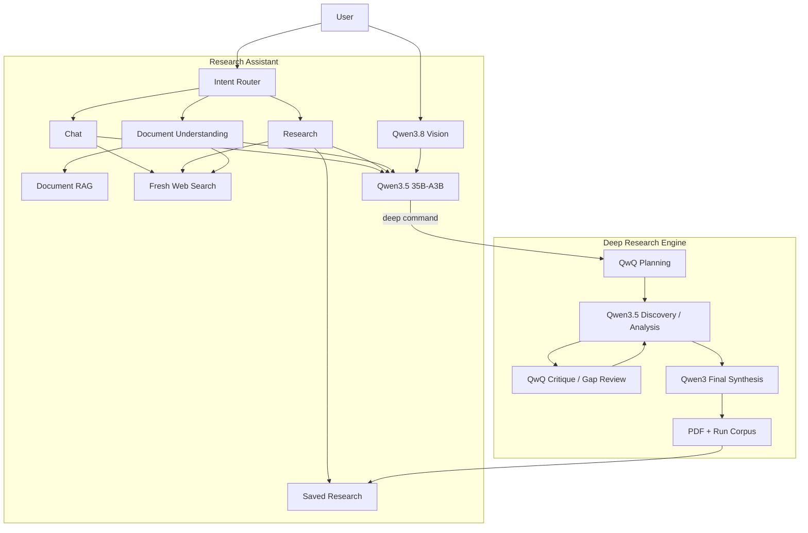

The important architectural rule is:

> **Deep Research creates durable evidence; the Research Assistant uses that evidence interactively.**

The two applications, therefore, complement rather than duplicate each other.
